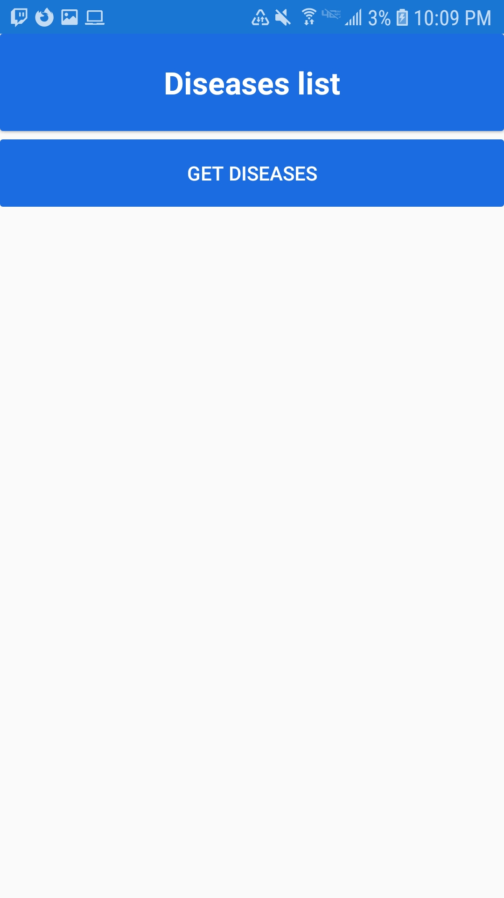
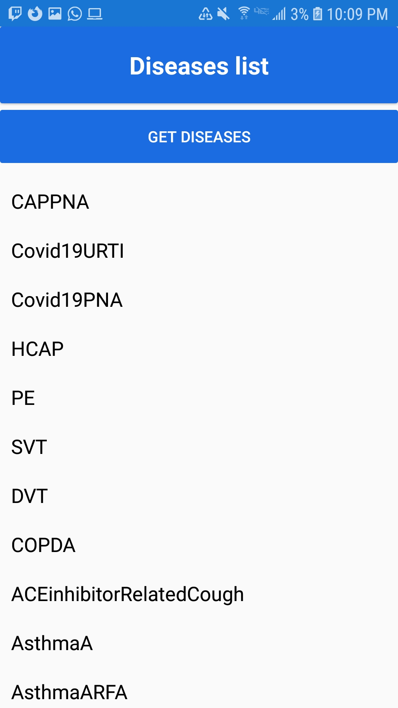
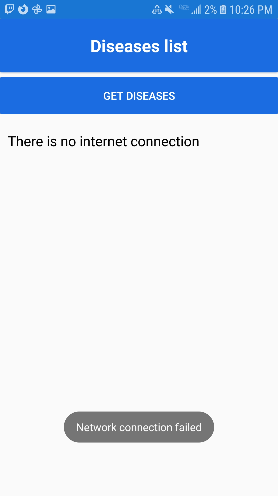

# GetDiseasesApp

- An App that fetches de data from the Endless Medical API, using the v1/dx/GetOutcomes endpoint, through the Refit package.
- According to de API documentation, this API returns every possible disease that a person may have, according with a list of symptoms.
- endpoint documentation description: "Retrieve all outcomes available in the API." 
- If there is no internet connection, then the app returns "There is no internet connection"
- API URL: https://endlessmedical.com/apidemoapp/

# API characteristics
- The API transfers information using the HTTPS protocol. 
- The endpoint used makes a GET request.
- The request does not need any parameters neather in the body, nor in the URL.
- Even though this endpoint does not receive payloads or body parameters, to make use of other endpoints, an API key is required.

# Screenshots

